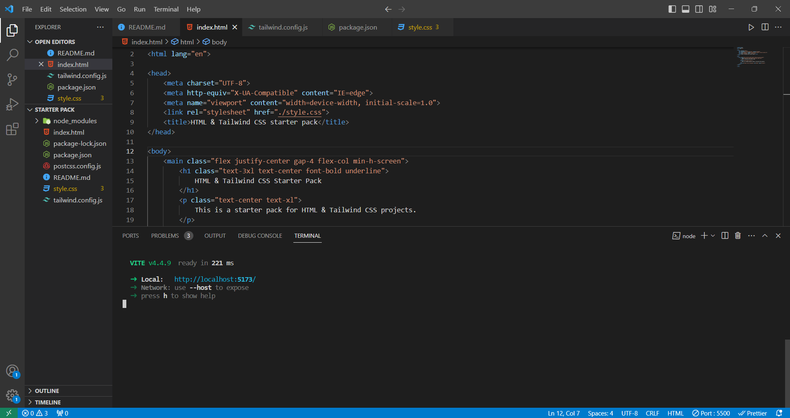

# TAILWIND CSS STARTER PACK

This is a starter pack for HTML & Tailwind CSS projects using vite.

(You can directly Access / Download it If you are not able to install Tailwind in your TERMINAL).

**1st Step.** ->
[Download](https://github.com/imyash9/Tailwind-CSS-starter-pack/archive/refs/heads/master.zip) this repo as a zip

**2nd Step** ->

_To Start your localhost you have to Run this Two commands in your Terminal :_

```bash
  npm install
```

```bash
  npm run start
```

_Copy this commands One-By-One, Paste in your TERMINAL and run_

After these 2 commands your Terminal will look like this



**3rd Step** ->

Now you have to go: [http://localhost:5173](http://localhost:5173)

_And if you are Facing any Issue Then here is the Tailwind-CSS documantation_

Prefer this [Documentation](https://tailwindcss.com/docs/installation/using-postcss) directly if you are facing any problem
